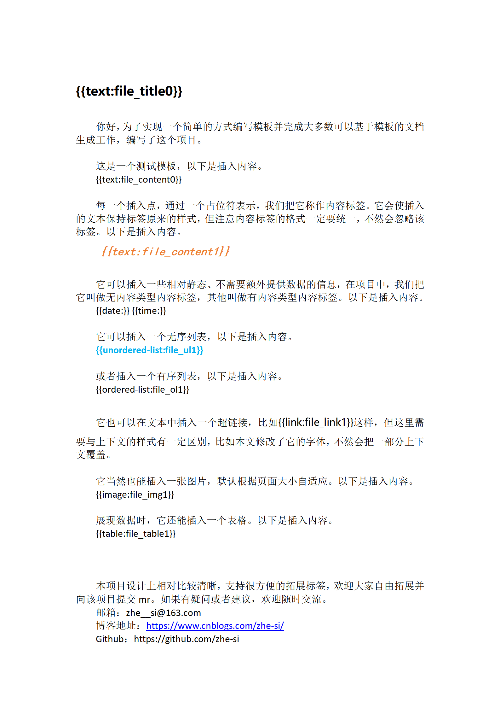
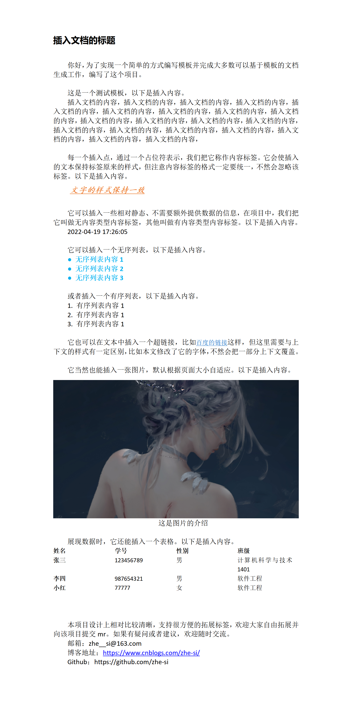

# 基于模板的 word 自动生成工具

依赖`python-docx`，实现了基于模板对 word 文档的自动生成。本文定义了一种极为简单的模板语法，无学习成本，对非开发人员也极为友好。

Relying on `python-docx`, it realizes the automatic generation of word documents based on templates. This article defines an extremely simple template syntax that has no learning cost and is extremely friendly to non-developers.


## 用户说明

### 使用方法

1. 首先自定义模板，并在待插入数据的地方使用内容标签占位，可参考 data/template-demo.docx
2. 以字典方式提供数据，每种插入类型的数据格式不同
3. 指定模板路径、生成路径与生成文件名，执行并输出异常信息，得到生成的word文件

生成过程如下：

模板内容：

```
我的朋友是{{text:friend}}。
```

传入参数数据：

```
dict = {
    "friend": "小明",
}
```

文档生成结果：

```
我的朋友是小明。
```


### 模板规则

待插入内容采用 `{{type:name}}` 内容标签格式，例如：`{{text:t1}}`。工具会直接使用实际内容替换内容标签，不修改模板内容部分的格式与其他内容，但要求内容标签的格式完全相同，否则不会识别该标签。

- name: 内容标签名，需要模板内全局唯一，不符合条件的模板无法载入

- type: 预定义的内容标签类型，模板会忽略无法识别的类型，如果不指定，则默认为 `text`

  类型主要分为两种：无内容类型与有内容类型。
  - 无内容类型会自动根据当前情况填写信息，`name`自动忽略，可省略`name`，但不能省略`:`
  
    常见的类型有：
    - date: 当前日期，默认格式为 `YYYY-MM-DD`
    - time: 当前时间，默认24小时制，格式为 `HH:MM:SS`
  
  - 有内容类型根据 `name` 在生成文档时指定填写的内容，不可为空。
  
    常见的类型有：
    - text: 文本
    - unordered-list: 无序列表
    - ordered-list: 有序列表
    - image: 图片
    - table: 表格
    - link: 链接


### 数据加载

每一组加载的数据都是一个`内容标签名:待插入数据`的字典，文档生成器根据模板内的内容标签读取这组数据生成单个文档。可以看作：一片生成的文档 = 一个模板（可复用） + 一组对应数据。由于模板通用，所以甚至可认为一组数据对应一篇文档。

数据可能存在若干组（是一个可迭代获取的对象），由数据加载器负责加载每组数据到文档生成器。若无数据，返回 None。


### 魔法数据

加载的每组数据字典中，可以附加系统定义的魔法数据，以对生成的文档进行特殊定制。魔法数据形如 '__name\_\_'，用户定义的内容标签名不应与魔法数据名重名。

现有的魔法数据有：

1. __doc_name\_\_

   生成文档名（不包含文件后缀），可为路径形式，如：a/b，会自动创建a文件夹并在其中生成b.docx。

   由于文档与数据的一对一关系，也可看作所有数据的唯一标识。

2. __tem_name\_\_

   使用的模板名，模板名应该全局唯一，不允许重名。


### 文档生成说明

插入内容采用字典格式，key为模板中内容标签的`name`，`value`为实际内容。不同类型的插入内容`value`格式不同。

插入内容字典中模板不需要的内容会被自动忽略。字典中缺少的内容，其内容标签保留，并输出提示。


## 架构说明


## 效果展示

模板：



生成文档：




## 其他说明

欢迎点赞收藏，也欢迎提出修改建议或者mr。

联系方式：

- 邮箱：zhe__si@163.com
- 博客地址：https://www.cnblogs.com/zhe-si/
- Github：https://github.com/zhe-si
